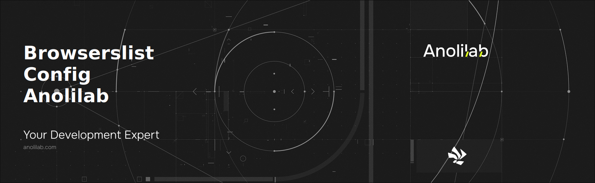

<!-- START_PACKAGE_OG_IMAGE_PLACEHOLDER -->

<a href="https://github.com/anolilab/semantic-release" align="center">

  

</a>

<h3 align="center">Shareable browserlist config for Anolilab projects.</h3>

<!-- END_PACKAGE_OG_IMAGE_PLACEHOLDER -->

<br />

<div align="center">

[![typescript-image][typescript-badge]][typescript-url]
[![mit licence][license-badge]][license]
[![npm downloads][npm-downloads-badge]][npm-downloads]
[![Chat][chat-badge]][chat]
[![PRs Welcome][prs-welcome-badge]][prs-welcome]

</div>

---

<div align="center">
    <p>
        <sup>
            Daniel Bannert's open source work is supported by the community on <a href="https://github.com/sponsors/prisis">GitHub Sponsors</a>
        </sup>
    </p>
</div>

---

## Install

```sh
npm install browserslist-config-anolilab
```

```sh
yarn add browserslist-config-anolilab
```

```sh
pnpm add browserslist-config-anolilab
```

## Usage

### Package.json

```json
{
    "browserslist": ["extends browserslist-config-anolilab"]
}
```

Alternatively, add this to `.browserslistrc` file:

```
extends browserslist-config-anolilab
```

Or when using [babel-preset-env](https://github.com/babel/babel/tree/master/experimental/babel-preset-env)

```js
module.exports = {
    presets: [
        [
            "env",
            {
                targets: {
                    // eslint-disable-next-line global-require
                    browsers: require("browserslist-config-anolilab"),
                },
            },
        ],
    ],
}
```

## What is Browserslist?

[Browserslist](https://github.com/browserslist/browserslist) is a library to share a browsers list between different front end tools, like Autoprefixer, Eslint, and Stylelint.

-   Valid Browserslist query syntax validation [browserl.ist](http://browserl.ist)
-   ["Browserslist is a Good Idea"](https://css-tricks.com/browserlist-good-idea/) (blog post by [@chriscoyier](https://github.com/chriscoyier))

## Supported Browsers

```json
{
    "legacyBrowsers": ["> 1%", "last 2 versions", "Firefox ESR"],
    "modernBrowsers": [
        "last 2 Chrome versions",
        "not Chrome < 60",
        "last 2 Safari versions",
        "not Safari < 10.1",
        "last 2 iOS versions",
        "not iOS < 10.3",
        "last 2 Firefox versions",
        "not Firefox < 54",
        "last 2 Edge versions",
        "not Edge < 15"
    ],
    "node": ["last 2 node major versions"],
    "production": ["> 1%", "last 2 versions", "Firefox ESR", "not dead"],
    "ssr": ["node 22"]
}
```

## Related

## Supported Node.js Versions

Libraries in this ecosystem make the best effort to track [Node.js' release schedule](https://github.com/nodejs/release#release-schedule).

Here's [a post on why we think this is important](https://medium.com/the-node-js-collection/maintainers-should-consider-following-node-js-release-schedule-ab08ed4de71a).

## Contributing

If you would like to help take a look at the [list of issues](https://github.com/anolilab/javascript-style-guide/issues) and check our [Contributing](.github/CONTRIBUTING.md) guidelines.

> **Note:** please note that this project is released with a Contributor Code of Conduct. By participating in this project you agree to abide by its terms.

## Credits

-   [Daniel Bannert](https://github.com/prisis)

-   [All Contributors](https://github.com/anolilab/javascript-style-guide/graphs/contributors)

## Made with ❤️ at Anolilab

This is an open source project and will always remain free to use. If you think it's cool, please star it 🌟. [Anolilab](https://www.anolilab.com/open-source) is a Development and AI Studio. Contact us at [hello@anolilab.com](mailto:hello@anolilab.com) if you need any help with these technologies or just want to say hi!

## License

The anolilab browserslist-config-anolilab is open-sourced software licensed under the [MIT][license-url]

<!-- badges -->

[license-badge]: https://img.shields.io/npm/l/browserslist-config-anolilab?style=for-the-badge
[license]: https://github.com/anolilab/javascript-style-guide/blob/main/LICENSE
[npm-downloads-badge]: https://img.shields.io/npm/dm/browserslist-config-anolilab?style=for-the-badge
[npm-downloads]: https://www.npmjs.com/package/browserslist-config-anolilab
[prs-welcome-badge]: https://img.shields.io/badge/PRs-welcome-brightgreen.svg?style=for-the-badge
[prs-welcome]: https://github.com/anolilab/javascript-style-guide/blob/main/.github/CONTRIBUTING.md
[chat-badge]: https://img.shields.io/discord/902465130518949899.svg?style=for-the-badge
[chat]: https://discord.gg/4VuvwWGaaB
[typescript-badge]: https://img.shields.io/badge/Typescript-294E80.svg?style=for-the-badge&logo=typescript
[typescript-url]: https://www.typescriptlang.org/
[license-url]: https://opensource.org/licenses/MIT
